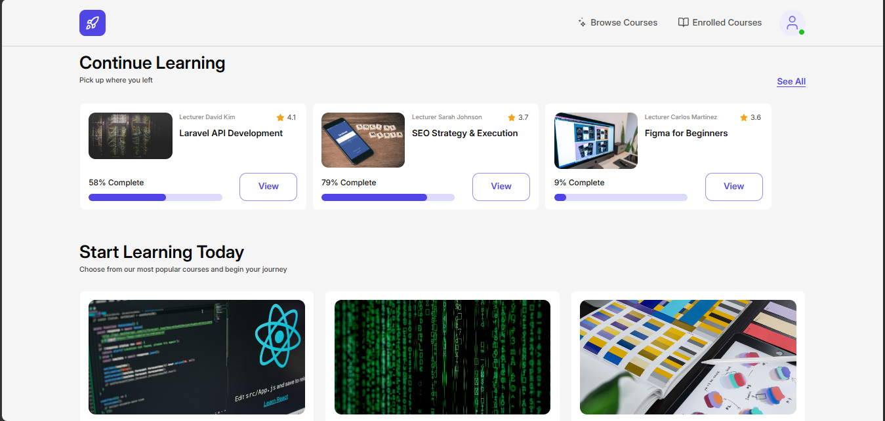
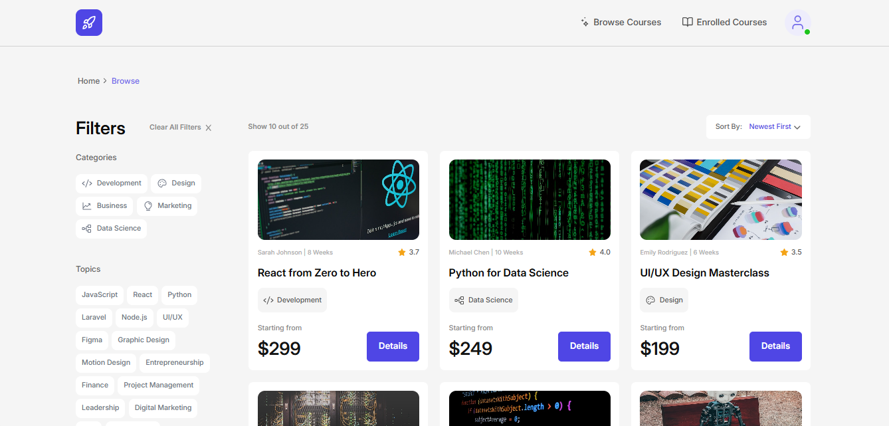
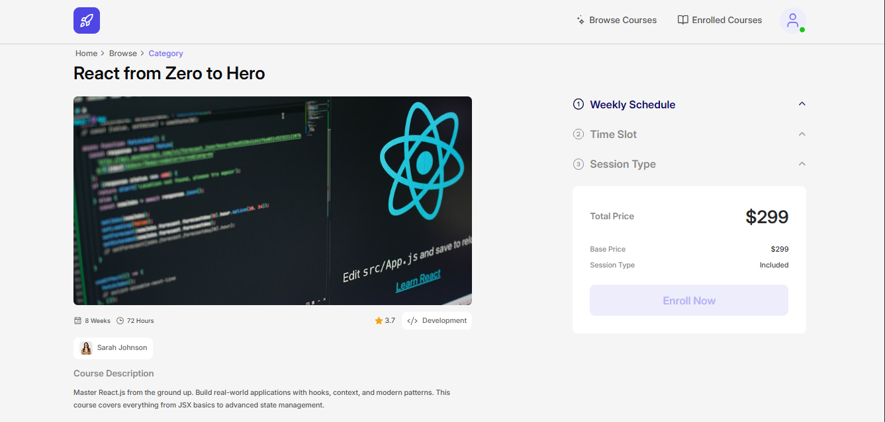

# Online Courses Platform

A modern online learning platform built with React, TypeScript, Vite, and Tailwind CSS.

This project includes a full course browsing and enrollment flow, authentication, profile completion, dashboard experiences for guests and authenticated users, and detailed course interactions such as selecting schedules, enrolling, completing a course, rating it, and retaking it.

## What I Built

- A dashboard with:
  - featured courses
  - continue learning section
  - enrolled courses side panel
- A full courses catalog with:
  - filters
  - sorting
  - pagination
  - real backend integration
- A detailed course page with:
  - real course data
  - weekly schedule, time slot, and session type selection
  - enrollment flow
  - conflict handling
  - enrollment confirmation
  - course completion
  - retake flow
  - rating flow
- Authentication and profile-completion gating
- Shared modal flows for important course actions

## Tech Stack

- React 19
- TypeScript
- Vite
- Tailwind CSS
- React Router
- TanStack Query
- Axios
- Sonner
- Font Awesome

## Main Features

- Browse featured and catalog courses
- Filter courses by category, topic, and instructor
- Sort and paginate courses
- View detailed course information
- Select weekly schedules, time slots, and session types
- Enroll in a course with backend integration
- Handle schedule conflicts with confirmation flow
- Complete a course and rate the experience
- Retake completed courses
- Track in-progress learning from the dashboard
- Open enrolled courses from the navigation side panel

## Getting Started

```bash
npm install
npm run dev
npm run build
npm run preview

```

## How To Use

- This version of the website is currently optimized for large screens and desktop/laptop devices.
- Responsive support is coming soon.
- If you open the project on a smaller screen, use a desktop device when possible, or zoom out the browser for a better experience.
- Some course flows depend on backend seed data.
- A few courses may already be enrolled, completed, or have limited / full seats.
- To get the full experience, choose a course that still has available seats and try different schedule options if one path is already taken.

## Notes

- The project currently focuses on the desktop experience.
- Backend-driven course data can affect enrollment availability, schedule conflicts, and progress states.
- If a demo flow looks unavailable, try another course or another session type.

## Live Demo

[Open the live website](https://online-course-rk.netlify.app/)

## Demo Video

Add your walkthrough video link here.

Example:

```md
[Watch the demo video](https://youtu.be/nc9XMe1BkGs)
```

## Screenshots

Example:

## Screenshots






